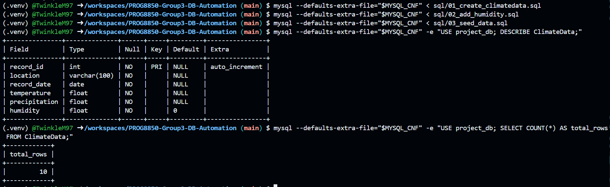
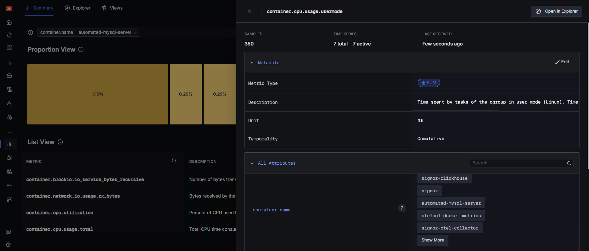
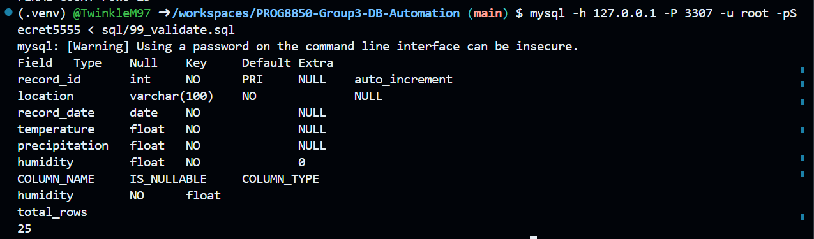

# MySQL Database Automation with Monitoring and CI/CD

## Overview
This project automates the creation, update, and validation of a MySQL database schema with data seeding and concurrent query execution. It also integrates monitoring using SigNoz and OpenTelemetry, and includes a CI/CD pipeline using GitHub Actions.

## Features
- Automated MySQL schema creation and column addition
- Data seeding from SQL scripts
- Multi-threaded query execution in Python
- Integrated monitoring with SigNoz dashboards
- CI/CD with GitHub Actions

## Prerequisites
- Docker & Docker Compose
- Python 3.11 or higher
- MySQL Client
- GitHub repository with Actions enabled

## Project Structure
```
.github/workflows/ci_cd_pipeline.yml     # GitHub Actions workflow
.secrets/mysql.cnf                       # MySQL connection config (ignored in git)
monitoring/                               # Monitoring stack configs
scripts/multi_thread_queries.py           # Python script to run queries concurrently
sql/                                      # SQL schema, seed, and validation files
run_all.sh                                # Script to run all steps locally
docker-compose.yml                        # Optional: for local stack
```

## Local Setup & Execution

### 1. Clone the Repository
```bash
git clone https://github.com/TwinkleM97/Group3-FinalProject-DBAutomation.git
```

### 2. Create Secrets File
```bash
mkdir -p .secrets
cat > .secrets/mysql.cnf <<EOF
[client]
host=127.0.0.1
user=root
password=Secret5555
port=3306
database=project_db
EOF
```

### 3. Start Services with Docker Compose
```bash
docker-compose up -d
```

### 4. Run All Steps Locally
```bash
chmod +x run_all.sh
./run_all.sh
```

This will:
1. Start MySQL container via Docker Compose
2. Wait for DB to be ready
3. Create schema (`sql/01_create_schema.sql`)
4. Add new column (`sql/02_add_humidity.sql`)
5. Seed data (`sql/03_seed_data.sql`)
6. Run concurrent queries via Python (`scripts/multi_thread_queries.py`)
7. Validate database (`sql/99_validate.sql`)

## GitHub Actions CI/CD
The GitHub Actions workflow (`.github/workflows/ci_cd_pipeline.yml`) runs automatically on every push and performs:
- MySQL service startup
- Schema creation and column updates
- Data seeding
- Concurrent query execution
- Validation queries
- Log artifact upload

## Monitoring Setup
Monitoring is configured using the files:
- `monitoring/otel/otel-collector-config.yaml`
- `monitoring/otel/docker-metrics-collector.yaml`
- `monitoring/signoz`

Start the monitoring stack:
```bash
docker-compose -f monitoring/signoz/docker-compose.yaml up -d
```

## Screenshots & Results

### MySQL Version Check


### MySQL Running Status


### Schema and Rows


### SigNoz Containers Up


### Query Logs for ClimateData


### Connections Panel


### IO Wait Panel


### Memory Usage


### CPU Usage Seconds


### CPU Utilization


### CPU User Mode


### CPU Kernel Mode


### Total CPU Usage


### Container CPU Metrics


### General Log Error Example


### Dashboard View


### SQL Validation Output


### Pipeline Success


